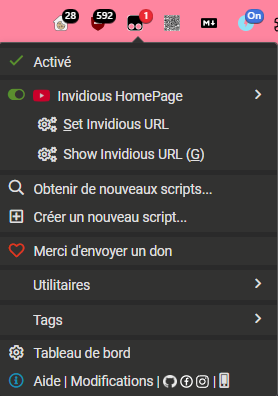
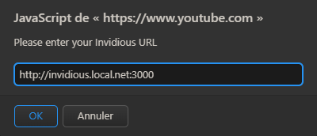
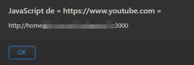
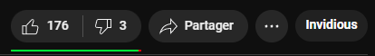

# Tampermonkey scripts

My Tampermonkey scripts

All files will be class by domain-directory

## YouTube.com

### Invidious HomePage

Details

This script will add a link under video title to send you to your Invidious instance.

#### Settings

Click on the add-on button and you will find two menu items:

- **Set Invidious URL** : set your own url to Invidious
- **Show Invidious URL**: to let you show the current url set

If you click on `Set Invidious URL`, a JS alert will ask you the url with the format.

Then, you can check the current invidious url when you choose `Show Invidious URL`:

⚠️ **After settings the URL, refresh the page to update the link correctly**

### Go To Invidious

Details

This script will add a button under the video to open the current video in your Invidious instance.

#### Settings

ℹ️ Same as **Invidious HomePage**

